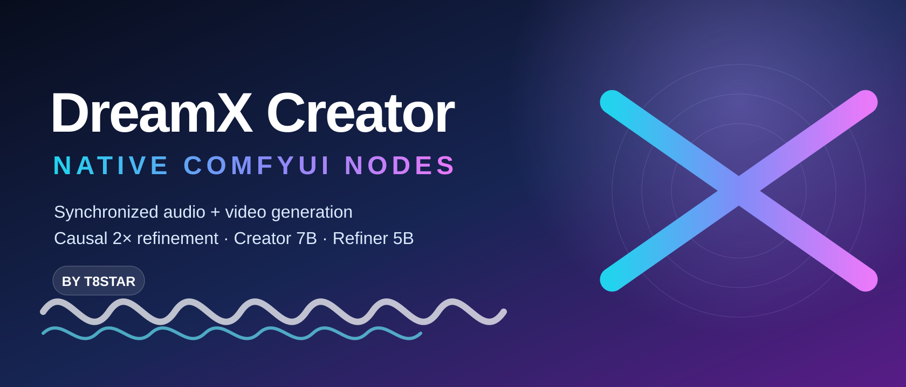

<div align="center">
  

  <h1>DreamX-Creator 1.0: Democratizing Native Audio-Video Generation at 2K Resolution</h1>

  DreamX Team

</div>

<div align="center">

[](https://arxiv.org/abs/2608.31106)
[](https://huggingface.co/t8star/DreamX-Creator-Comfy)
[](https://huggingface.co/GD-ML/DreamX-Creator)
[](https://modelscope.cn/models/GD-ML/DreamX-Creator)
[](LICENSE)
[](https://github.com/T8mars/Comfyui-DreamX-Creator-T8)

</div>

-----

## :art: ComfyUI Native Nodes by T8star



This repository packages the released DreamX-Creator generator and causal 2x
refiner as native ComfyUI V3 nodes. It provides frontend-importable workflows,
native `MODEL`, `CLIP`, `VAE`, `LATENT`, `AUDIO`, `GUIDER`, and `VIDEO` types,
ComfyUI model offloading, checkpoint verification, and a guarded Windows SDPA
fallback for 24 GB GPUs.

Install **DreamX Creator T8** from ComfyUI Manager, or install it manually:

```bash
cd ComfyUI/custom_nodes
git clone https://github.com/T8mars/Comfyui-DreamX-Creator-T8.git
cd Comfyui-DreamX-Creator-T8
python -m pip install -r requirements.txt
```

Download the model weights separately, restart ComfyUI, then drag one of these
frontend workflows onto the canvas:

- [`examples/dreamx_creator_ui.json`](./examples/dreamx_creator_ui.json) — first-frame to synchronized video and audio.
- [`examples/dreamx_refiner_ui.json`](./examples/dreamx_refiner_ui.json) — separate 2x refinement pass that preserves audio and FPS.

See [`COMFYUI.md`](./COMFYUI.md) for the model layout, node graph, VRAM notes,
and verification commands. Model weights are not bundled with the node package.

### 2.0.2 compatibility notes

- The Creator and Refiner load their vendored torch layers coherently on the
  GPU, avoiding mixed CPU/CUDA weights under ComfyUI's generic partial-offload
  path.
- One synchronized audio/video pair is generated per execution; use queue batching
  for multiple seed variants.
- Duration is truncated down to a Wan-compatible `4N+1` frame count (5 s at
  24 FPS becomes 117 frames), and the Refiner exposes only its exact-length IMAGE
  sequence instead of a padded generic LATENT.
- The Creator example uses ComfyUI's `normal` scheduler with Euler at 20 steps,
  matching the released Diffusers FlowMatch timestep sequence. The bundled Audio
  VAE stays in float32, matching the released decoder path.
- The quick-start UI profile now generates directly at 256 spatial tokens
  (512×512 for a square input), 2 seconds / 24 FPS / 20 steps, with a verified
  fixed seed. Its `4N+1` frame snap produces 45 frames (1.875 s). Check the
  Creator output before optional 2× refinement; the Refiner cannot recover a
  collapsed low-resolution base sample. Native speech is stochastic, so the
  prompt can request exact wording but cannot guarantee its transcript.
- The shipped Creator UI graph uses native `VAEDecodeTiled`, while the Refiner
  tiles its Wan VAE encode/decode internally, avoiding long-video cuDNN failures.
- The Refiner loader defaults to `window_chunk=1` and three latent KV-history
  frames on 24 GB Windows systems to limit WDDM shared-memory spill; the original
  nine-frame history remains selectable on higher-memory systems.

## :link: T8star Links

| Resource | Link |
| --- | --- |
| Bilibili | [T8star on Bilibili](https://space.bilibili.com/385085361) |
| YouTube | [@T8star-Aix](https://www.youtube.com/@T8star-Aix/) |
| Seedance API | [API signup](https://api.seedance.nz/sign-up?aff=5f4w) |
| Online AI Apps | [RunningHub profile](https://www.runninghub.ai/zh-cn/user-center/1907375370302308353/userPost?inviteCode=rh-v1121) |
| ComfyUI Package | [Quark download](https://pan.quark.cn/s/264edb7e36bd) |
| ComfyUI Model Weights | [t8star/DreamX-Creator-Comfy](https://huggingface.co/t8star/DreamX-Creator-Comfy) |
| Hugging Face Profile | [huggingface.co/t8star](https://huggingface.co/t8star) |

**DreamX-Creator 1.0** is a research framework for **native joint audio-video generation**. Given a first frame and a text prompt, its implemented base generator jointly models modality-specialized video and audio streams, using **Gated Cross-Modal Attention** and **Progressive Joint Training** to enable bidirectional audio-video interaction.

The broader system combines **Audio-Video Reinforcement Learning** with **Modality-Aware Multimodal Feedback** to improve visual and audio quality, semantic consistency, and fine-grained audio-video synchronization. **Autoregressive 1-Step 2K Refinement** then upgrades the generated video to high-quality 2K output while preserving content, motion, and audio-aligned timing.

## :clapper: Demo

<div align="center">
  <video src="https://github.com/user-attachments/assets/e49fc64d-5b31-4c16-be1d-737dc3aef04b" controls></video>
</div>

## :fire: News

- **Sep 3, 2026:** Open-sourced the model weights and released the inference code for the 7B joint audio-video generator and the Autoregressive 1-Step 2K Refiner.
- **Sep 1, 2026:** Initialized the DreamX-Creator project repository with its overview and release roadmap.

## :calendar: Plan

- :heavy_check_mark: Initialize the DreamX-Creator project repository.
- :heavy_check_mark: Release the DreamX-Creator 1.0 technical report.
- :heavy_check_mark: Release validated model weights, inference code, and configurations.
- [ ] Release distilled, faster models with fewer sampling steps for reduced latency.

## :open_file_folder: Repository Structure

- [`COMFYUI.md`](./COMFYUI.md) — native ComfyUI V3 nodes, installation, workflows, and tests.
- [`audio_video_generation/`](./audio_video_generation/) — 7B native joint audio-video generator (single GPU). See its [README](./audio_video_generation/README.md) for usage, input overrides, and memory options.
- [`video_refiner/`](./video_refiner/) — Autoregressive 1-step 2K refiner (SR-DiT 5B). See its [README](./video_refiner/README.md) for usage and the full list of inference knobs.
- [`checkpoints/`](./checkpoints/) — All model weights (not in the git repo). See its [README](./checkpoints/README.md) for the expected layout and download instructions.

## :package: Model Weights

Download the complete ComfyUI-ready bundle from
[t8star/DreamX-Creator-Comfy](https://huggingface.co/t8star/DreamX-Creator-Comfy).
It contains 20 required model/config/tokenizer files and is approximately
54.25 GB (50.53 GiB). The original weights are from
[GD-ML/DreamX-Creator](https://huggingface.co/GD-ML/DreamX-Creator) and
[ModelScope](https://modelscope.cn/models/GD-ML/DreamX-Creator).

Recommended shared-model installation:

```bash
hf download t8star/DreamX-Creator-Comfy --local-dir ComfyUI/models/dreamx_creator
```

With `model_root=auto`, the loader searches the node-local `checkpoints/` directory
first and then `ComfyUI/models/dreamx_creator/`. The shared directory must have this
structure (details in [`checkpoints/README.md`](./checkpoints/README.md)):

```
ComfyUI/models/dreamx_creator/
├── creator/                     # DreamX-Creator 1.0 joint generator (7B, LoRA merged)
│   ├── video_model/             # video DiT shards + config
│   ├── audio_model/             # audio DiT + config
│   └── cross_attn_weights.safetensors  # gated A2V/V2A cross-modal attention
├── audio_vae/                   # CreatorDACVAE audio VAE
├── refiner/                     # 2K refiner
│   ├── sr_dit_5b.pt             # SR-DiT 5B refiner
│   ├── latent_upsampler_flash.pt       # FlashLatentUpsampler (default)
│   ├── latent_upsampler_2d_causal.pt   # causal 2D latent upsampler (optional)
│   └── lightvae_nu_scheme3.pt          # distilled fast decoder (optional, off by default)
└── wan2.2_ti2v_5b/              # shared Wan2.2-TI2V-5B dependencies
    ├── Wan2.2_VAE.pth           # video VAE
    ├── models_t5_umt5-xxl-enc-bf16.pth  # UMT5-xxl text encoder
    └── google/umt5-xxl/         # tokenizer
```

The `wan2.2_ti2v_5b/` directory can also be downloaded directly from
[Wan-AI/Wan2.2-TI2V-5B](https://huggingface.co/Wan-AI/Wan2.2-TI2V-5B); only the
three entries above are needed.

## :rocket: Quickstart

Each subdirectory is self-contained with its own `requirements.txt` and README.

**1. Joint audio-video generation** (first frame + prompt to synchronized
video with audio):

```bash
cd audio_video_generation
pip install -r requirements.txt
./inference.sh                        # runs the default Verse-Bench case (case1)
```

See [audio_video_generation/README.md](./audio_video_generation/README.md) for
input overrides, CPU-offload options, output details, and multi-GPU
sequence-parallel inference.

**2. 2K refinement** (super-resolve a generated or external video, audio
unchanged):

```bash
cd ../video_refiner
pip install -r requirements.txt
INPUT=/path/to/video.mp4 bash run_inference.sh
```

See [video_refiner/README.md](./video_refiner/README.md) for the full list of
knobs (KV cache, window attention, speed/quality trade-offs).

## :books: Citation

If you find DreamX-Creator useful in your research, please consider citing our technical report:

```bibtex
@misc{zhu2026dreamxcreatordemocratizingnativeaudiovideo,
  title={DreamX-Creator: Democratizing Native Audio-Video Generation at 2K Resolution},
  author={Jiashu Zhu and Yanhao Zheng and Ruitian Tian and Rujing Dang and Shen Zhang and Bingze Song and Jiachen Lei and Ruimin Lin and Jiahong Wu and Xiangxiang Chu},
  year={2026},
  eprint={2608.31106},
  archivePrefix={arXiv},
  primaryClass={cs.CV},
  url={https://arxiv.org/abs/2608.31106},
}
```

## :scroll: License

This project is licensed under the Apache License 2.0. See [LICENSE](LICENSE) for details.

## :sparkles: Acknowledgement

We would like to thank the [Wan Team](https://github.com/Wan-Video/Wan2.2), the [OpenMOSS Team](https://github.com/OpenMOSS/MOVA), and the [VideoX-Fun Team](https://github.com/aigc-apps/VideoX-Fun) for their outstanding open-source work on Wan, MOVA, and VideoX-Fun, respectively.
